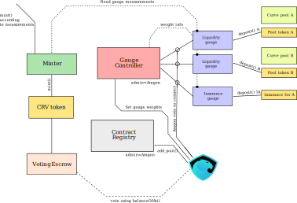
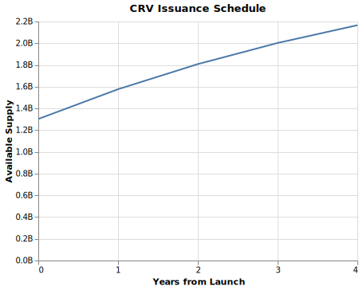

# Curve DAO

Curve DAO consists of multiple smart contracts connected by Aragon. Apart from
that, standard Aragon's 1 token = 1 vote method is replaced with the voting
weight proportional to locktime, as will be described below.

Curve DAO has a token CRV which is used for both governance and value accrual.

## Time-weighted voting. Vote-locked tokens in VotingEscrow

Instead of voting with token amount , in Curve DAO tokens are lockable
in a _VotingEscrow_ for a selectable locktime , where ,
and . After locking, the time _left to unlock_
is . The voting weight is equal to:

In other words, the vote is both amount- and time-weighted, where the time
counted is how long the tokens cannot be moved in future.

The account which locks the tokens cannot be a smart contract (because can be
tradable and/or tokenized), unless it is one of whitelisted smart contracts
(for example, widely used multi-signature wallets).

_VotingEscrow_ tries to resemble Aragon's Minime token. Most importantly,
`balanceOf() / balanceOfAt()` and `totalSupply() / totalSupplyAt()`
return the time-weighted voting weight  and the sum of all of those weights
 respectively. Aragon can interface _VotingEscrow_ as if it was
a typical governance token.

Locks can be created with `create_lock()`,  extended in time with `increase_unlock_time()`
or token amount with `increase_amount()`, and `withdraw()` can remove tokens
from the escrow when the lock is expired.

### Implementation details

User voting power  is linearly decreasing since the moment of lock.
So does the total voting power . In order to avoid periodic check-ins,
every time the user deposits, or withdraws, or changes the locktime, we
_record user's slope and bias_ for the linear function  in
`user_point_history`. We also change slope and bias for the total voting
power  and record in `point_history`. In addition, when
user's lock is scheduled to end, we _schedule_ change of slopes of
 in the future in `slope_changes`. Every change involves increasing the
`epoch` by 1.

This way we don't have to iterate over all users to figure out, how much should
 change by, neither we require users to check in periodically. However,
we limit the end of user locks to times rounded off by whole weeks.

Slopes and biases change both when a user deposits and locks governance tokens,
and when the locktime expires. All the possible expiration times are rounded to
whole weeks to make number of reads from blockchain proportional to number of
missed weeks at most, not number of users (which can be potentially large).

## Inflation schedule. ERC20CRV

Token _ERC20CRV_ is an ERC20 token which allows a piecewise linear inflation
schedule. The inflation is dropping by  every year.
Only _Minter_ contract can directly mint _ERC20CRV_, but only within the limits
defined by inflation.

Each time the inflation changes, a new mining epoch starts.

Initial supply of CRV is  billion tokens, which is $42\% of the eventual
() supply of  billion tokens.
All of those initial tokens tokens are gradually vested (with every block).
The initial inflation rate which supports the above inflation schedule is
 (279.6 millions per year). All of the inflation is distributed to users of Curve,
according to measurements taken by _gauges_.
During the first year, the approximate inflow into circulating supply is 2 millions
CRV per day, starting from 0.

## System of Gauges. LiquidityGauge and GaugeController

In Curve, inflation is going towards users who use it. The usage is measured
with Gauges. Currently there is just _LiquidityGauge_ which measures, how much
liquidity does the user provide. The same type of gauge can be used to measure
"liquidity" provided for insurance.

For _LiquidityGauge_ to measure user liquidity over time, the user deposits
his LP tokens into the gauge using `deposit()` and can withdraw using `withdraw()`.

Coin rates which the gauge is getting depends on current inflation rate,
and gauge _type weights_ (which get voted on in Aragon). Each user gets
inflation proportional to his LP tokens locked. Additionally, the rewards
could be _boosted_ by up to factor of 2.5 if user vote-locks tokens for Curve
governance in _VotingEscrow_.

The user _does not_ require to periodically check in. We describe how this is
achieved in technical details.

_GaugeController_ keeps a list of Gauges and their types, with weights of each
gauge and type.

Gauges are per pool (each pool has an individual gauge).

### LiquidityGauge implementation details

Suppose we have the inflation rate  changing with every epoch (1 year),
gauge weight  and gauge type weight . Then, all the gauge handles
the stream of inflation with the rate  which it can
update every time , or mining epoch changes.

In order to calculate user's fair share of , we essentially need to
calculate the integral:

where  is the balance supplied by user (measured in LP tokens) and
 is total liquidity supplied by users, depending on the time ;
the value  gives the amount of tokens which user has to have minted
to him.
The user's balance  changes every time user $u makes a deposit or withdrawal,
and  changes every time _any_ user makes a deposit or withdrawal (so $S
can change many times in between two events for the user ).
In _LiquidityGauge_ contract, the vaule of  is recorded in the
`integrate_fraction` map, per-user.

In order to avoid all users to checkpoint periodically, we keep recording values
of the following integral (named `integrate_inv_supply` in the contract):

The value of  is recorded at any point any user deposits or withdraws,
as well as every time the rate  changes (either due to weight change
or change of mining epoch).

When a user deposits or withdraws, the change in  can be calculated as
the current (before user's action) value of  multiplied by the
pre-action user's balance, and sumed up across user's balances:

The per-user integral is possible to repalce with this sum because  is
unchanged for all times between  and .

In order to incentivize users to participate in governance, and additionally
create stickiness for liquidity, we implement the following mechanism.
User's balance counted in the _LiquidityGauge_ gets boosted by users locking
CRV tokens in _VotingEscrow_, depending on their vote weight :

The value of  is taken at the time user performs any action (deposit,
withdrawal, withdrawal of minted CRV tokens) and is applied until the next
action this user performs.

If no users vote-lock any CRV (or simply don't have any), the inflation will
simply be distributed proportionally to the liquidity  each one of them
provided. However, if a user stakes much enough CRV, he is able to boost his
stream of CRV by up to factor of 2.5 (reducing it slightly for all users who are
not doing that).

Implementation details are such that a user gets the boost actual at the time of
the last action or checkpoint. Since the voting power decreases with time, it is
favorable for users to apply a boost and do no further actions until they vote-lock
more tokens. However, once vote-lock expires, everyone can "kick" the user by
creating a checkpoint for that user and, essentially, resetting the user to
no boost if he/she has no voting power at that point already.

Finally, the gauge is supposed to not miss a full year of inflation (e.g. if
there were no interactions with the guage for the full year). If that ever
happens, the abandoned gauge gets less CRV.

## Weight voting for gauges

Instead of simply voting for weight change in Aragon, users can allocate their
vote-locked tokens towards one or other Gauge (pool). That pool will be getting
a fraction of CRV tokens minted proportional to how much vote-locked tokens are
allocated to it. Eeach user with tokens in VotingEscrow can change his/her
preference at any time.

When a user applies a new weight vote, it gets applied only in the beginning of
the next whole week (this is done for scalability reasons). The weight vote for
the same gauge can be changed not more often than once in 10 days.

### GaugeController implementation details

In order to implement weight voting, _GaugeController_ has to include parameters
handling linear character of voting power each user has.

Similarly to how it is done in _VotingEscrow_, _GaugeController_ records
points (bias+slope) per gauge in `vote_points`, _scheduled_ changes in biases
and slopes for those points in `vote_bias_changes` and `vote_slope_changes`,
with those changes happening every round week, as well as current slopes for
every user per-gauge in `vote_user_slopes`, along with the power the user has
used and the time their vote-lock ends.
The totals for slopes and biases for vote weight per gauge, and sums of those
per type, get scheduled / recorded for the next week, as well as the points
when voting power gets to 0 at lock expiration for some of users.

When user changes his preferences, the change of the gauge weight is scheduled
for the next round week, not immediately. This is done in order to reduce the
number of blockchain reads which need to be performed by each user: that will
be proportional to the number of weeks since the last change instead of the
number of interactions other users did.

_GaugeController_ is one of the most central pieces to the system, so it must be
controlled by the DAO. No centralized admin should control it, to not give anyone
powers to change type weights unilaterally.

## Fee burner

Every pool allows the admin to collect fees using `withdraw_admin_fees`. Aragon
should be able to collect those fees to the admin account and use them to buy
and burn CRV on a free market once that free market exists.
That should be possible to be done by anyone without a vote.

Instead of burning, there could be different mechanisms working with the same
interface. In any case, this will not be immediately applied.

## Gauges to rewards trading volume and governance votes

Both votes and trades are discrete events, so they can use the same sort of gauge.
The idea is that each event has a weight which exponentially decays over time.

It should be possible to call a gauge contract every time a user votes in Aragon.
